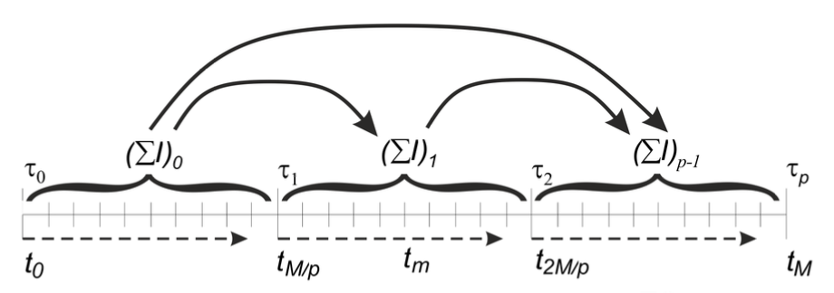
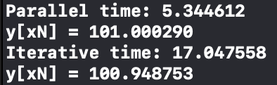
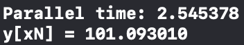
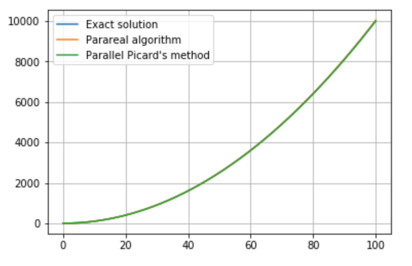
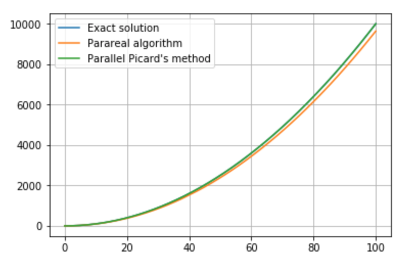

# Курсовая работа по дисциплине "Архитектура вычислительных систем" по теме "Решение задачи Коши на GPU при помощи API Metal" 

## Введение

Дифференциальные уравнения находят применение в различных областях науки: многие физические законы являются дифференциальными уравнениями, относительно некоторых функций; в биологии они используются, например, для описания популяции; широкое применение они находят и в моделях экономической динамики.

С ростом количества входных данных ставится вопрос о ускорении численного решения дифференциальных уравнений, а также их систем.

Целью данной работы ставится рассмотрение возможности распараллеливания решения задачи Коши для однородного дифференицального уравнения (ОДУ) первого порядка вида: 

Распараллеливание будет проведено с использованием графического процессора (GPU), так как он имеет значительное преимущество перед CPU при параллельной обработке большого набора информации.

В качестве программного обеспечения будет использован фреймворк Metal, как современный инструмент для папаллельных вычислений для платформ Apple.

Использованные аппаратные средства:

CPU - Intel Core i5 2.7 GHz (dual core)

GPU - Intel Iris Graphics 6100 1536 MB

## Краткий план

Работа состоит из двух частей:

1. Реализация метода последовательных приближений Пикара для решения задачи Коши в 2 вариантах: последовательном и параллельном. Сравнение производительности.
2. Реализация параллельного алгоритма Parareal. Анализ производительности.

## Часть 1. Метод последовательных приближений Пикара

Метод последовательных приближений Пикара - один из алгоритмов для решения задачи Коши, который можно распараллелить по времени. Это означает, что вся область поиска решения задачи разбивается на подобласти, количество которых совпадает с количеством задействованных потоков. В каждой подобласти  задача Коши решается одновременно и независимо используя заранеее найденное приближенное решение задачи при t = .
Для ознакомления с этим методом была использована книга "Методы параллельных вычислений" (3, стр. 169-172), где можно найти более подробное описание алгоритма.
Для начала рассмотрим последовательный вариант алгоритма.

### 1.1. Последовательный алгоритм
Рассматриваем задачу Коши (1).
Интегрируя ДУ, заменим задачу эквивалетным интегральным уравнением:

Решая уравнение методом последовательных приближений, получим итерационный процесс Пикара:

Численная реализация метода выполняется с помощью квадратурных формул.
Пусть  - приближенное решение задачи Коши в узле  на k-й итерации. Используя квадратурную формулу трапеций получим:

Итерационный процесс прекращается при достижении заданной точности, например при 

### 1.2. Параллельный алгоритм

Область поиска решенния  разобьем на непересекающиеся подобласти  ( = 0,...,p+1) количество которых совпадает с количеством потоков p. На каждом интервале приближенное решение расчитывается в M/p узлах.

На каждой k-й итерации -й поток выполняет следующие действия:
1. Одновременно с другими потоками вычисляет значения определенных интегралов , l = 0,...,M/p-1 своей подобласти по квадратурной формуле. 
2. Выполняет суммирование полученных значений и осуществляет пересылку расчитанных сумм потокам с номерами больше .
3. Получив значения, производит вычисление , а также все значения приближенного решения в своей подобласти: 

Наглядно алгоритм можно увидеть на изображении:

Точность вычислений в методе Пикара существенно зависит от величины интервала интегрирования  и может быть повышена за счет применения адаптивных квадратурных формул.

### 1.3. Сравнение производительности программных реализаций

Последовательный алгоритм был реализован с использованием языка C, а паралельный с использованием Objective C + Metal.
После нахождения оптимального количества потоков удалось добиться ускорения в среднем в 3 раза по сравнению с последовательным алгоритмом.

Для демонстрации возьмем следующую задачу Коши:

Аналитическим решением которого является функция y(x) = 1 + .

Область решения разбивалась на  точек. Количество потоков в параллельном алгоритме - 512. Итерационный процесс заканчивался, когда максимум разностей предыдущего и текущего решения в каждой точке становился меньше 0.0001.
Было измерено время нахождения решения 50 уравнений каждого алгоритма. Результат:

где y[] - значения y в последней точке интервала. Необходимы для того, чтобы сверять, корректны ли найденные ответы.

Можно заметить, что при реализации параллельного метода после того как потоки параллельно высчитали значения интегралов и их сумму происходит перессылка суммы следующим потокам. Эта операция выполняется последовательно в промежутке между итерациями за , где p - число потоков. Поэтому с некоторого достаточно большого количества потоков алгоритм может начать терять свою производительность и вовсе начать выполняться медленее последовательной версии.

## Часть 2. Алгоритм Parareal

Parareal - параллельный алгоритм численного анализа, используемый для решения задач Коши. Изобретен в 2001 году. Также как и метод последовательных приближений Пикара является алгоритмом с временным параллелизмом.
Рассмотрим описание алгоритма, а также его программную реализацию.

### 2.1. Описание алгоритма Parareal

Алгоритм основан на итеративном применении двух методов интегрирования. Один из них, обозначим как F, должен иметь высокую точность и соответственно высокие вычислительные затраты. Второй, обозначим как G, наоборот должен быть вычислительно дешевым, но может иметь малую точность.

Как и в предыдущем алгоритме разбиваем область поиска на подобласти , с количеством равным количеству потоков. Далее сначала на каждой итерации с помощью дешевого алгоритма G вычисляем значения функции в граничных узлах. Этот алгоритм используем большой шаг равный длине подобласти, который обозначим за h. После чего, зная значения функции в граничных узлах, каждую подобласть разбиваем с помощью некоторого малого шага t на еще более мелкие подобласти и параллельно вычисляем значения для каждой подобласти  с шагом t. В итоге в граничных узлах мы получили 2 значения функции - решения с использованием дешевого алгоритма с большим шагом  и более точного алгоритма с меньшим шагом . Находим дефект: , который будет использоваться для вычисления значения функции в граничных узлах в следующей итерации.

Следующая итерация начинается с нахождения граничных значений по следующей формуле:

или

Продолжаем итерации, пока не получим необходимую точность.

В данном алгоритме значения функций F на каждой подобласти на каждой итерации вычисляются параллельно. Между итерациями необходимо последовательно вычислять значения функции G.

Хорошую визуализацию алгоритма можно посмотреть в статье на [Википедии](https://en.wikipedia.org/wiki/Parareal).

### 2.2. Программная реализация

В качестве точного метода был выбран метод Рунге-Кутта 4-го порядка. В качестве менее затратного метод Рунге-Кутта 2-го порядка.

С теми же входными данными, что и в пункте 1 получился следующий результат:

Получилось, что данный алгоритм быстрее в среднем быстрее в 2 раза, чем метод Пикара. Но его недостаток в том, что на некоторых входных данных могут возникать проблемы в сходимости. Решалось это следующим образом - итерации продолжались до тех пор, пока точность с каждой следующей итерацией повышалась. Как только наступала итерация, при которой точность начинала падать, решение останавливалось и предыдущее решение выдавалось как максимально точное. Понятно, что при таком подходе не всегда можно достичь заданной точности. Подробнее о вопросах сходимости метода можно прочесть в источниках 4-6.

### Сравнение методов:

1. Интервал - [0, 100]. Количество точек - 1024 * 16. Количество потоков - 1024.

2. Интервал - [0, 100]. Количество точек - 1024. Количество потоков - 128.

Как видно, при достаточно малом шаге оба метода ведут себя хорошо. Но при увеличении шага и уменьшении количества потоков метод Parareal становится менее точным, чем метод Пикара. Такое поведение может наблюдаться при различных входных данных. Но его преимуществом является быстрота.

Графики были построены с использованием Python на основании данных, полученных с каждой из программ.

## Использованные источники:

1. [Официальная докуметация по Metal](https://developer.apple.com/documentation/metal)
2. [Примеры программ с использованием Metal](https://developer.apple.com/metal/sample-code/)
3. [Методы параллельных вычислений (А. В. Старченко, В. Н. Берцун)](http://math.tsu.ru/sites/default/files/mmf2/e-resources/parallel_comp_meth.pdf)
4. [Parareal Methods (Scott Field)](http://www.cfm.brown.edu/people/jansh/page5/page10/page40/assets/Field_Talk.pdf)
5. [Статья на википедии о алгоритме Parareal](https://en.wikipedia.org/wiki/Parareal)
6. [Realtime Computing with the Parareal Algorithm (Christopherr Harden)](http://diginole.lib.fsu.edu/islandora/object/fsu:182428/datastream/PDF/view)
